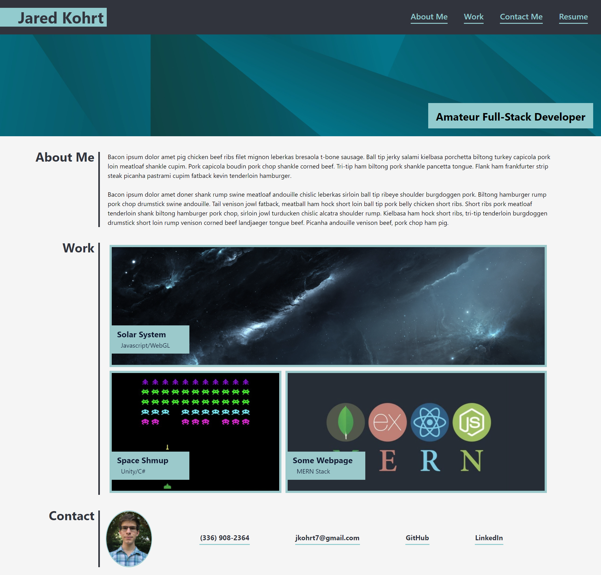

# Portfolio_Page_V1  

## Description  

A personal portfolio page written in CSS and HTML (plus two on-click JS functions to open projects in separate tabs). This landing page includes links to some of my existing web-related projects; currently, two of the three projects are placeholders, but the solar system project is in a functional state. To learn more about that particular project, you can click [here](https://github.com/jkohrt7/THREE.js_Solar-System). The page also includes several ways to contact me and a link to my resume.

## Installation and Usage 
The webpage is hosted with Github Pages and can be found here: https://jkohrt7.github.io/Portfolio_Page_V1/

This webpage runs on all modern browsers and requires no additional installations or notable hardware requirements. In the "Work" subsection of the webpage, there are several of my projects, each of which have slightly different requirements (and much different usage instructions). Currently, the Shmup and MERN stack projects are not linked (they are in development and will open an empty webpage) but clicking the solar system project will open it in a new tab. As mentioned earlier, you can visit the repository for that project [here](https://github.com/jkohrt7/THREE.js_Solar-System).   

## Credits

This project was created as part of the UNC Full-Stack web-development course; they did not provide any source code for this assignment. A big thanks to CSS Trick's flexbox tutorials for guiding me through a couple tight spots; their full tutorial can be found [here](https://css-tricks.com/snippets/css/a-guide-to-flexbox/).

## License

MIT License

Copyright (c) [2021] [Jared_Kohrt]

Permission is hereby granted, free of charge, to any person obtaining a copy
of this software and associated documentation files (the "Software"), to deal
in the Software without restriction, including without limitation the rights
to use, copy, modify, merge, publish, distribute, sublicense, and/or sell
copies of the Software, and to permit persons to whom the Software is
furnished to do so, subject to the following conditions:

The above copyright notice and this permission notice shall be included in all
copies or substantial portions of the Software.

THE SOFTWARE IS PROVIDED "AS IS", WITHOUT WARRANTY OF ANY KIND, EXPRESS OR
IMPLIED, INCLUDING BUT NOT LIMITED TO THE WARRANTIES OF MERCHANTABILITY,
FITNESS FOR A PARTICULAR PURPOSE AND NONINFRINGEMENT. IN NO EVENT SHALL THE
AUTHORS OR COPYRIGHT HOLDERS BE LIABLE FOR ANY CLAIM, DAMAGES OR OTHER
LIABILITY, WHETHER IN AN ACTION OF CONTRACT, TORT OR OTHERWISE, ARISING FROM,
OUT OF OR IN CONNECTION WITH THE SOFTWARE OR THE USE OR OTHER DEALINGS IN THE
SOFTWARE.

